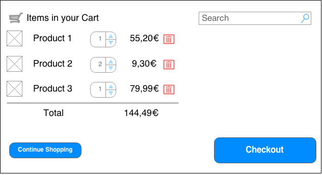
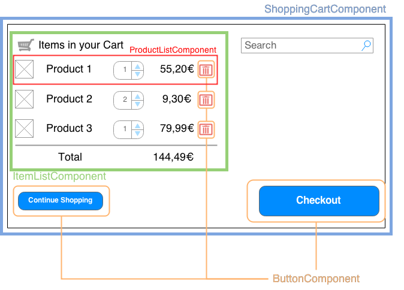
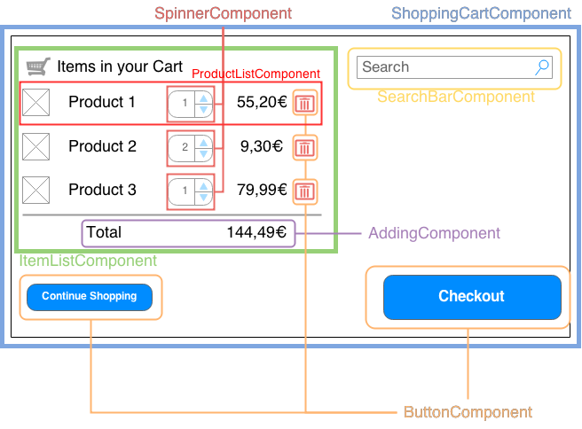
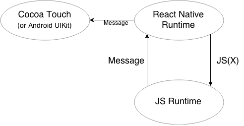

title: React
author: Robin Thrift
twitter: RobinThrift
homepage: RobinThrift.com
shortcodes: true
css:
    - 'http://fonts.googleapis.com/css?family=Droid+Sans:400,700|Source+Code+Pro|Kaushan+Script'
reveal:
    controls: true
    progress: true
    slideNumber: true
    history: true
    keyboard: true
    overview: true
    transition: 'linear'
    backgroundTransition: 'slide'

-- {
    background: 
        img: '#cb5243'
}

# [var title]
#### A JAVASCRIPT LIBRARY FOR BUILDING USER INTERFACES

<div class="author-info">
    <h5>[var author]</h5>
    <a href="http://twitter.com/[var twitter]">@[var twitter]</a>
</div>

--

### "A JavaScript library for building [accented]user interfaces[/accented] "

-- {
    transition: fade
    classes: 
        - 'mvc-overview'
}

- <strong>M</strong>odel
- <strong>V</strong>iew
- <strong>C</strong>ontroller

-- {
    transition: none
    classes: 
        - 'mvc-overview'
        - 'mvc-overview__2'
}

- <strong>M</strong>odel
- <strong>V</strong>iew
- <strong>C</strong>ontroller

--

### Everything Is A Component

-- {
    transition: fade
}



-- {
    transition: fade
}




-- {
    transition: none
}



--

"Reduce [emphasize]Coupling[/emphasize], increase [emphasize]Cohesion[/emphasize]"

--
"[emphasize]Coupling[/emphasize] is the manner and degree of interdependence between software modules."

[small][http://en.wikipedia.org/wiki/Coupling_%28computer_programming%29](http://en.wikipedia.org/wiki/Coupling_%28computer_programming%29)[/small]

--
"[emphasize]Cohesion[/emphasize] refers to the degree to which the elements of a module belong together."

[small][http://en.wikipedia.org/wiki/Cohesion_(computer_science)](http://en.wikipedia.org/wiki/Cohesion_%28computer_science%29)[/small]
--


```js
class Hello extends React.Compontent {
    render() {
        return <div>Hello World, at {new Date().toString()}</div>;
    }
}
```

-- {
    background:
        img: http://i.giphy.com/gtfppP6qR3tiU.gif
}


## [white]Is that  HTML in my  JavaScript!?[/white]

--

## Yes...
[fragment]but no[/fragment]

--

### Meet
<h2>[fragment]JSX[/fragment]</h2>


--

```js
render() {
    return <div>Hello World, at {new Date().toString()}</div>;
}
```
⟱ JSX Transformer ⟱
```js
render() {
    return React.createElement('div', {}, 'Hello World, at ', new Date().toString());
}
```

[fragment]
`React.createElement(name, attributes, children...)`
[/fragment]

--

```js
class App extends React.Component {
    render() {
        return (
            <div className="main">
                <div className="picture-bg">
                    
                </div>
                <Clock />
                <CmdLine ps1="λ" />
                <LinksBox />
            </div>
        );
    }
}
```
--

```js
class Hello extends React.Component {
    render() {
        let items = this.props.items;
        return (
            <div>      
                <h3>{this.props.title}</h3>
                <ul>
                    {items.map((item, i) => {
                       return <li key={i}>{item.title}</li>                   
                    })}
                </ul>
            </div>      
        );
    }
}
```

--

### Let's talk about Props
[fragment]
These things: `<Clock ` <span class="text--emphasize text--mono">format="HH:mm"</span> ` />`
[/fragment]

--

```js
class Clock extends React.Component {
    render() {
        let time = moment().format(this.props.format);
        return (<time>{time}</time>);
    }
}
```

```js
// ...
    render() {
        return (<div><Clock format="HH:mm" /></div>);
    }
// ...
```

--

### PropTypes

```js
class Clock extends React.Component {
    render() {
        let time = moment().format(this.props.format);
        return (<time>{time}</time>);
    }
}
Clock.propTypes = {
    format: React.PropTypes.string
};
```

--

PropTypes

```js
React.PropTypes.array,
React.PropTypes.bool,
React.PropTypes.func,
React.PropTypes.number,
React.PropTypes.object,
React.PropTypes.string,
React.PropTypes.node,
React.PropTypes.element,
React.PropTypes.instanceOf(Message),
React.PropTypes.oneOf(['News', 'Photos']),
React.PropTypes.oneOfType([
  React.PropTypes.string,
  React.PropTypes.number,
]),
React.PropTypes.arrayOf(React.PropTypes.number),
React.PropTypes.objectOf(React.PropTypes.number),
React.PropTypes.shape({
  color: React.PropTypes.string,
  fontSize: React.PropTypes.number
}),
React.PropTypes.func.isRequired,
React.PropTypes.any.isRequired,
customProp: function(props, propName, componentName) {
  if (!/matchme/.test(props[propName])) {...}
}
```
[PropType Docs](https://facebook.github.io/react/docs/reusable-components.html#prop-validation)

--

hello.angular.js
```js
angular.module('Hello')
    .directive('hello', function() {
        return {
            scope: {
                date: '=',
                items: '='
            },
            templateUrl: 'my-template.tpl.html',
            controller: function($scope) {
                $scope._clickHandler = function(item) {
                    alert(item.title);
                }
            }
        }  
    });
```
my-template.tpl.html
```html
<h3>{{date}}</h3>
<ul>
    <li ng-repeat="item in items" ng-click="_clickHandler(item)">
        {{item.title}}
    </li>
</ul>
```

--

hello.react.jsx
```js
class Hello extends React.Component {
    render() {
        return (
            <div>      
                <h3>{this.props.date}</h3>
                <ul>
                    {items.map((item, i) => {
                       return <li onClick={this._clickHandler.bind(this, item)} 
                                key={i}>{item.title}</li>                   
                    })}
                </ul>
            </div>      
        )
    }

    _clickHandler(item) {
        alert(item.title);
    }
}
Hello.propTypes = {
    items: React.PropTypes.array,
    date: React.PropTypes.instanceOf(Date)
};
Hello.defaultProps = {
    date: new Date().toString(),
    items: []
};
```

--

```js
class InputTest extends React.Component {
    render() {
        return (<input type="text" value="Hello" />);
    }
}
```

[fragment]

[/fragment]

[small][Source](https://github.com/RobinThrift/react-pres-code/tree/INPUT_EXAMPLE_1)[/small]

--

### Immutability

--

### Immutability

- no bindings
- no DOM events
- when the Compontents change:   
rerender entire DOM

--

### Virtual DOM
[fragment]
It's just like the real DOM
[/fragment]

[fragment]
But fast!
[/fragment]

-- 

- mimics the real DOM

[fragment]
- renders only the difference

`diff: (Tree, Tree) → ∆Tree`
[/fragment]

[fragment]
Tree Diffing is usually ∈ O(n<sup>3</sup>)!
[/fragment]

[fragment]
By using heurstics, Reacts Diffing Algorithm ∈ O(n)  
[small][More](https://facebook.github.io/react/docs/reconciliation.html)[/small]
[/fragment]


--

### State

-- {
    transition: fade
}

```js
class InputTest extends React.Component {
    constructor(props) {
        super(props);
        this.state = {val: 'Hello'};
    }

    render() {
        return (<input type="text" value={this.state.val} />);
    }
}
```
[fragment]

[/fragment]

-- {
    transition: fade
}

```js
class InputTest extends React.Component {
    constructor(props) {
        super(props);
        this.state = {val: 'Hello'};
    }

    render() {
        return (<input type="text" value={this.state.val}
            onChange={this._handleChange.bind(this)} />);
    }

    _handleChange(event) {
        this.setState({val: event.target.value});
    }
}
```

[fragment]

[small][Source](https://github.com/RobinThrift/react-pres-code/tree/INPUT_EXAMPLE_2)[/small]
[/fragment]

--

### Lifecycle Methods

- Mounting
    - `componentWillMount`
    - `componentDidMount`
- Updating
    - `componentWillReceiveProps(nextProps)`
    - `shouldComponentUpdate(nextProps, nextState)`
    - `componentWillUpdate(nextProps, nextState)`
    - `componentDidUpdate(prevProps, prevState)`
- Unmounting
    - `componentWillUnmount`

--

### Unidirectional Data-Flow
#### Single Source Of Truth

[half]

[/half]

[half]

Mutable:
```js
this.setState(...)
```

Immutable:
```js
this.props
```
[/half]

-- 

### Conclusions & More Benefits
- simpler architecture
    - tying 'templates' and 'display logic' together
- server side rendering
- synthetic event system & virtual DOM make   
testing easier
- can easily be integrated with existing frameworks

⟹  simpler, safer, and more expressive code

-- {
    background: 
        img: '#cb5243'
}

# React Native

--

"Write Once, Run Anywhere"
[fragment]Success Rate:[/fragment]
[fragment]0%[/fragment]

--

"Learn Once, Write Anywhere"

--



--

### Benefits

- declarative UIs
- (non UI) code can be shared between different platforms
- faster iteration (live reloading)
- CSS-Like styling with flexbox
