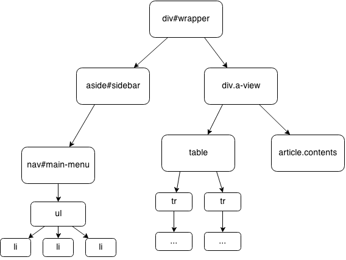
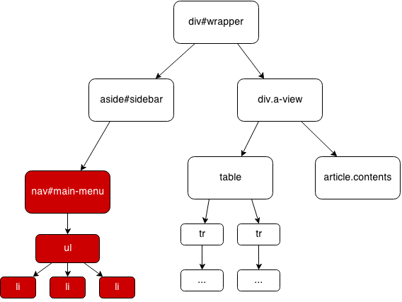
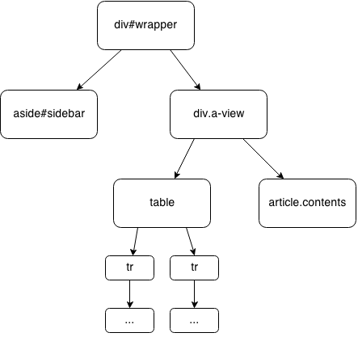
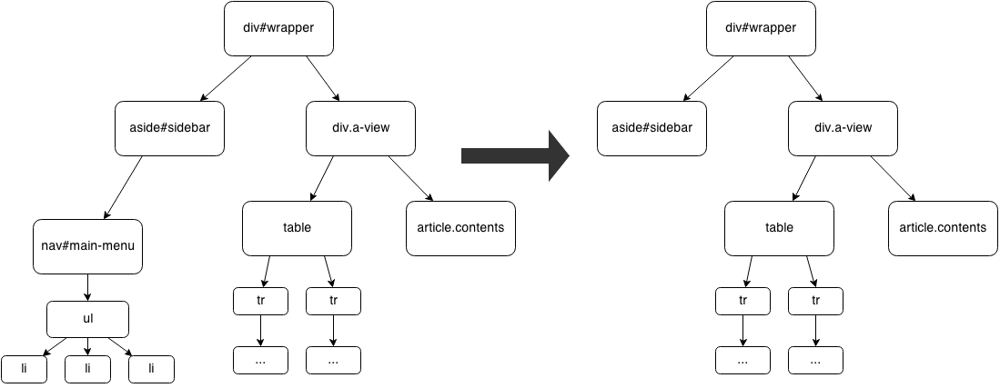

title: React
author: Robin Thrift
twitter: RobinThrift
homepage: RobinThrift.com
shortcodes: true
css:
    - 'http://fonts.googleapis.com/css?family=Open+Sans:300italic,300,700|Ubuntu:400,700|Source+Code+Pro'
reveal:
    controls: true
    progress: true
    slideNumber: true
    history: true
    keyboard: true
    overview: true
    transition: 'linear'
    backgroundTransition: 'slide'

-- {
    background: 
        img: '#cb5243'
}

#[var title]
### A JAVASCRIPT LIBRARY FOR BUILDING USER INTERFACES

<div class="author-info">
    <h5>[var author]</h5>
    <a href="http://twitter.com/[var twitter]">@[var twitter]</a>
    <a href="http://[var homepage]">[var homepage]</a>
</div>

--

## React?

- Declarative
- Immutable
- Virtual Dom Diffing

-- 

## One Step at a time...

--

## React is Declarative
[fragment]
#### Everything is a component
[/fragment]

--

```js
class Hello extends React.Compontent {
    render() {
        return (
            <div>Hello World, at {new Date().toString()}</div>
        );
    }
}
```

-- {
    background:
        img: http://i.giphy.com/gtfppP6qR3tiU.gif
}


## [white]Is that  HTML in my  JavaScript!?[/white]

--

hello.angular.js
```js
angular.module('Hello')
    .directive(function() {
        return {
            scope: {
                date: '=',
                items: '='
            },
            templateUrl: 'my-template.tpl.html',
            controller: function($scope) {
                $scope._clickHandler = function(item) {
                    alter(item.title);
                }
            }
        }  
    });
```
my-template.tpl.html
```html
<h3>{{date}}</h3>
<ul>
    <li ng-repeat="item in items" ng-click="_clickHandler(item)">
        {{item.title}}
    </li>
</ul>
```

--

hello.react.jsx
```js
class Hello extends React.Component {
    render() {
        return (
            <div>      
                <h3>{this.propts.date}</h3>
                <ul>
                    {items.map((item, i) => {
                       return <li onClick={this._clickHandler.bind(this, item)} 
                                key={i}>{item.title}</li>                   
                    })}
                </ul>
            </div>      
        )
    }

    _clickHandler(item) {
        alert(item.title);
    }
}
Hello.propTypes = {
    items: React.PropTypes.array,
    date: React.PropTypes.instanceof(Date)
};
```
--

PropTypes

```js
React.PropTypes.array,
React.PropTypes.bool,
React.PropTypes.func,
React.PropTypes.number,
React.PropTypes.object,
React.PropTypes.string,
React.PropTypes.node,
React.PropTypes.element,
React.PropTypes.instanceOf(Message),
React.PropTypes.oneOf(['News', 'Photos']),
React.PropTypes.oneOfType([
  React.PropTypes.string,
  React.PropTypes.number,
]),
React.PropTypes.arrayOf(React.PropTypes.number),
React.PropTypes.objectOf(React.PropTypes.number),
React.PropTypes.shape({
  color: React.PropTypes.string,
  fontSize: React.PropTypes.number
}),
React.PropTypes.func.isRequired,
React.PropTypes.any.isRequired,
customProp: function(props, propName, componentName) {
  if (!/matchme/.test(props[propName])) {...}
}
```

--

### Why?

- Components over separation of concerns
- tying 'templates' and 'display logic' together

#### ⟹  simpler, more expressive Code

--

## Immutability

--

- entire DOM is rerendered
- no "bindings"

[fragment]
... kinda
[/fragment]

--

## Virtual Dom Diffing

-- {
    transition: fade
}



-- {
    transition: fade
}




-- {
    transition: fade
}



--



--


--

### Benefits

- Simpler Architecture
- Browserless Rendering
- Predictable => Testable

--

## Flux

-- {
    background:
        img: img/flux.png
        size: 80% auto
}

--

```js
DateDisplay = React.createClass({
    propTypes: {                         
        date: React.PropTypes.object,    
        compareTo: React.PropTypes.object
    },                                   
    getDefaultProps: function() {        
        return {                         
            compareTo: moment()           
        };           
    },
    render: function() {
        return (
           <span className="date">{this.props.date.from(this.props.compareTo)}</span> 
        );
    };

});
```

--

```js
DateInput = React.createClass({
    getInitialState: function() {        
        return {                         
            date: moment().format('DD.MM.YY')
        };           
    },
    render: function() {
        return (
            <input name="dateInput" id="dateInput" 
                value={this.state.date} 
                onChange={this._changeHandler} />
        );
    },

    _changeHandler: function(e) {
        this.setState({
            date: e.target.value
        });
        if (typeof this.props.onChange === 'function') {
            this.props.onChange(e.target.value);
        }
    }
});
```

--

```js
App = React.createClass({
    getInitialState: function() {
        return {
            date: moment()
        };
    },
    render: function() {
        return (
            <div className='app-wrapper'>
                <DateInput onChange={this._onChange} />
                <DateDisplay date={this.state.date} />
            </div>
        );
    },
    _onChange: function(val) {
        var d = moment(val, 'DD.MM.YY');
        if (d.isValid()) {
            this.setState({
                date: d
            });
        }
    }
});
```

--

<iframe src="http://localhost:8000" style="width:800px;height:400px"></iframe>
